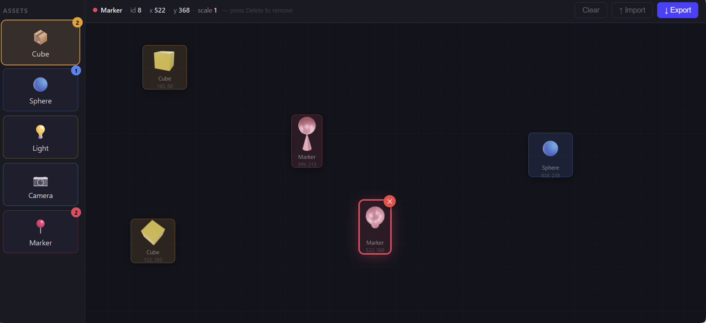
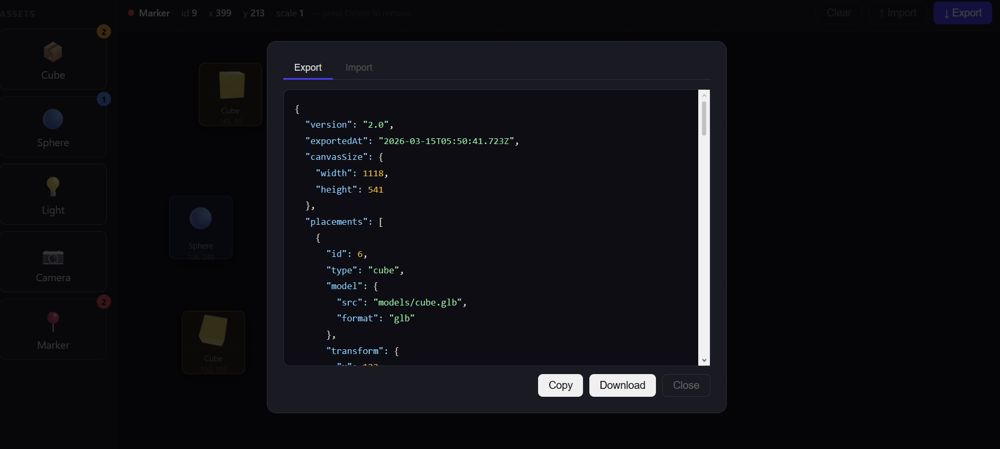

# AR Sandbox Toolkit

A minimal web-based sandbox for placing 3D assets on a canvas and exporting their positions as JSON.

## Screenshots





## Quick Start

```bash
# No build step required — open directly in any modern browser
open index.html        # macOS
start index.html       # Windows
xdg-open index.html    # Linux
```

Or serve locally to avoid any browser file-protocol restrictions:

```bash
npx serve .
# → http://localhost:3000
```

## Usage

| Action | How |
|---|---|
| Place an asset | Drag from the sidebar onto the canvas, **or** click an asset to place it at the center |
| Reposition | Click and drag any placed item |
| Remove | Hover over an item → click the **✕** badge |
| Clear all | Click **Clear** in the toolbar |
| Export | Click **↓ Export** → copy to clipboard or download `placements.json` |
| Import | Click **↑ Import** → paste or load a JSON file |

## Export Format

```json
{
  "version": "2.0",
  "exportedAt": "2025-07-14T10:00:00.000Z",
  "canvasSize": { "width": 1200, "height": 800 },
  "placements": [
    {
      "id": 1,
      "type": "cube",
      "model": { "src": "models/cube.glb", "format": "glb" },
      "transform": {
        "x": 320, "y": 240,
        "xNorm": 0.266667, "yNorm": 0.3,
        "width": 80, "height": 80,
        "scale": 1, "rotation": 0
      },
      "meta": { "label": "Cube", "icon": "📦", "color": "#f59e0b" }
    }
  ]
}
```

- `x` / `y` — pixel coordinates relative to the top-left corner of the canvas
- `xNorm` / `yNorm` — normalised coordinates (0–1) relative to canvas size
- `canvasSize` — viewport dimensions at export time
- `scale` / `rotation` — transform applied to the placed item

## Assets

| Icon | Type |
|---|---|
| 📦 | Cube |
| 🔵 | Sphere |
| 💡 | Light |
| 📷 | Camera |
| 📍 | Marker |

## Regenerating Models

The `.glb` models in `models/` are pre-built. To regenerate them:

```bash
npm install
npm run generate
```

## Stack

Plain HTML + CSS + vanilla JS — zero dependencies, zero build step.
